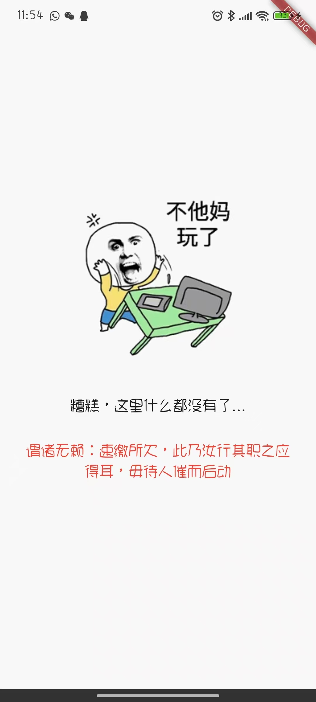

# Wulai Flutter SDK (wulai_flutter)


[简体中文](README.md) | English

## 📖 Project Description

`wulai_flutter` is a powerful and flexible due date management plugin specifically designed for Flutter applications. It aims to help developers easily integrate due date reminder functionalities, such as membership expiration, trial period ending, or any time-based service. By intelligently calculating remaining days, dynamically adjusting the transparency of UI elements, and providing customizable expiration callback mechanisms, `wulai_flutter` ensures your application can gracefully handle time-sensitive business logic and provide an intuitive user experience.

## ✨ Features

- 📅 **Smart Due Date Calculation**: Automatically and accurately calculates the remaining days until a specified due date.
- 🎨 **Dynamic Transparency**: Dynamically adjusts the transparency of UI elements based on the remaining time (e.g., lower transparency as the due date approaches), providing visual reminders.
- 🔔 **Expiration Callback**: Provides a flexible `onExpiryDateDue` callback method, allowing you to execute custom logic when the due date arrives, such as displaying pop-ups or sending notifications.
- 🎯 **UI Components**: Built-in pre-built Flutter Widgets like `Wulai` and `WulaiWarning`, ready to use out-of-the-box, helping you quickly integrate due date reminder interfaces.
- 📱 **Cross-Platform**: Fully compatible with iOS and Android platforms, ensuring a consistent user experience.

## 🎯 Requirements

To ensure the normal operation of the `wulai_flutter` plugin, your development environment needs to meet the following minimum requirements:

| Environment | Minimum Version |
|-------------|-----------------|
| Flutter     | 3.10.0          |
| Dart        | 3.0.0           |
| Android     | 21 (5.0)        |
| iOS         | 11.0            |

## 🚀 Quick Installation

### 1. Add Dependency

In your Flutter project's `pubspec.yaml` file, add `wulai_flutter` under the `dependencies` section:

```yaml
dependencies:
  flutter:
    sdk: flutter
  wulai_flutter: 0.0.1
```

Then run `flutter pub get` to fetch the new dependency.

### 2. Import Package

Import `wulai_flutter` in your Dart file where you need to use its functionalities:

```dart
import 'package:wulai_flutter/wulai_flutter.dart';
```

## 💡 Usage Examples

`wulai_flutter` provides a simple and intuitive API for managing and displaying due date information.

### Basic Usage

You can wrap your content with the `Wulai` Widget and pass in `dueDate` and the `onExpiryDateDue` callback. When the `dueDate` arrives, `onExpiryDateDue` will be triggered.

```dart
void main() {
  runApp(MyApp());
}

class MyApp extends StatelessWidget {
  MyApp({super.key});

  final dueDate = DateTime(2025, 10, 30);
  final today = DateTime.now();

  @override
  Widget build(BuildContext context) {
    return MaterialApp(
      title: 'Flutter Demo',
      theme: ThemeData(
        colorScheme: ColorScheme.fromSeed(seedColor: Colors.deepPurple),
      ),
      home: Wulai(
        dueDate: dueDate,
        deadlineDays: dueDate.difference(today).inDays,
        child: const MyHomePage(title: 'Flutter Demo Home Page'),
        whenExpiryDoThis: () { 
            // If you want to use the default page of the package, you do not need to declare; otherwise, please declare what you want to do.
            // 如果希望使用包的默认页面，则无需声明；否则，请在此处声明你想要执行的逻辑。

            return null;
        },
      ),
    );
  }
}
```


### `WulaiWarning` Component

`WulaiWarning` is a preset warning component used to display warning messages when the due date is approaching or has arrived.

```dart
WulaiWarning(
  message: 'Your trial period is about to end!',
  backgroundColor: Colors.orange,
  textColor: Colors.black,
  icon: Icons.warning,
);
```

## ⚙️ Configuration Options and Environment Variables

The `wulai_flutter` plugin itself does not rely on specific environment variables. All configurations are done through the properties of the `Wulai` Widget.

### `Wulai` Widget Properties

| Property Name     | Type                     | Description                                                              | Default Value |
|-------------------|--------------------------|--------------------------------------------------------------------------|---------------|
| `dueDate`         | `DateTime`               | Required. Specifies the due date.                                        | None          |
| `onExpiryDateDue` | `VoidCallback?`          | Optional. Callback function triggered when the due date arrives.         | `null`        |
| `builder`         | `WulaiBuilder`           | Required. Function used to build child Widgets, providing remaining days and opacity. | None          |
| `core`            | `WulaiCore?`             | Optional. Custom `WulaiCore` instance for advanced control.              | Internal default instance |

### `WulaiWarning` Widget Properties

| Property Name     | Type                     | Description                                                              | Default Value      |
|-------------------|--------------------------|--------------------------------------------------------------------------|--------------------|
| `message`         | `String`                 | Required. The warning message text.                                      | None               |
| `backgroundColor` | `Color?`                 | Optional. Background color of the warning.                               | `Colors.yellow`    |
| `textColor`       | `Color?`                 | Optional. Text color of the warning.                                     | `Colors.black`     |
| `icon`            | `IconData?`              | Optional. Icon for the warning.                                          | `Icons.info_outline` |
| `padding`         | `EdgeInsetsGeometry?`    | Optional. Inner padding of the warning content.                          | `EdgeInsets.all(8.0)` |
| `margin`          | `EdgeInsetsGeometry?`    | Optional. Outer margin of the warning component.                         | `EdgeInsets.symmetric(vertical: 8.0)` |
| `borderRadius`    | `BorderRadiusGeometry?`  | Optional. Border radius of the warning box.                              | `BorderRadius.circular(4.0)` |

## 🤝 Contribution Guidelines

We warmly welcome contributions from the community! If you are interested in improving `wulai_flutter`, please follow these steps:

1.  **Fork** this repository to your GitHub account.
2.  **Clone** your forked repository locally.
    ```bash
    git clone https://github.com/ctkqiang/wulai_flutter.git
    ```
3.  **Create a new branch** for your feature development or bug fix.
    ```bash
    git checkout -b feature/your-feature-name
    ```
4.  **Write code** and ensure it follows the project's coding standards.
5.  **Write tests** and ensure all tests pass.
6.  **Commit your changes**.
    ```bash
    git commit -m "feat: Add new feature"
    ```
7.  **Push to your remote repository**.
    ```bash
    git push origin feature/your-feature-name
    ```
8.  **Create a Pull Request** to the `main` branch of `wulai_flutter`. Please describe your changes and their purpose in detail.

### Development Workflow

-   **Bug Reports**: If you find any bugs, please submit them in GitHub Issues and provide detailed steps to reproduce.
-   **Feature Requests**: If you have ideas for new features, you are welcome to propose them in GitHub Issues.
-   **Code Review**: All Pull Requests will undergo code review before being merged.

## 📄 License Information

`wulai_flutter` is licensed under the MIT License. Please refer to the `LICENSE` file in the repository for details.

## 🚧 Project Status

`wulai_flutter` is currently under active development and maintenance. We are committed to providing a stable and efficient due date management solution. Suggestions and feedback are welcome!

## ❓ Troubleshooting

### 1. Plugin not working as expected

-   **Check `pubspec.yaml`**: Ensure `wulai_flutter` dependency is correctly added and `flutter pub get` has been run.
-   **Check `dueDate`**: Ensure the `dueDate` you passed in is a valid `DateTime` object and logically meets your expectations.
-   **Check `builder`**: Ensure the `builder` function correctly uses `remainingDays` and `opacity` parameters to build your UI.
-   **Check console output**: Look for any error or warning messages.

### 2. `onExpiryDateDue` not triggered

-   **Check `dueDate`**: Ensure the `dueDate` has indeed arrived or passed.
-   **Check callback logic**: Ensure the logic within `onExpiryDateDue` is correct and not blocked by other code.

### 3. UI transparency is incorrect

-   **Check `opacity` parameter**: Ensure you have correctly applied the `opacity` parameter to your Widget within the `builder` function.
-   **Check `dueDate`**: Transparency is calculated based on `dueDate` and the current time; please ensure `dueDate` is set correctly.

If none of the above methods solve your problem, please submit your issue in GitHub Issues and provide detailed reproduction steps and relevant code.

---

### 🌐 Global Donation Channels

#### Domestic Users

<div align="center" style="margin: 40px 0">

<div align="center">
<table>
<tr>
<td align="center" width="300">

<br />
<strong>🔵 Alipay</strong> (Little penguin collecting coins~)
</td>
<td align="center" width="300">

<br />
<strong>🟢 WeChat Pay</strong> (Little green dragon collecting coins~)
</td>
</tr>
</table>
</div>
</div>

#### International Users

<div align="center" style="margin: 40px 0">
  <a href="https://qr.alipay.com/fkx19369scgxdrkv8mxso92" target="_blank">
    
  </a>
  
  <a href="https://ko-fi.com/F1F5VCZJU" target="_blank">
    
  </a>
  
  <a href="https://www.paypal.com/paypalme/ctkqiang" target="_blank">
    
  </a>
  
  <a href="https://donate.stripe.com/00gg2nefu6TK1LqeUY" target="_blank">
    
  </a>
</div>

---

### 📌 Developer Social Graph

#### Technical Communication

<div align="center" style="margin: 20px 0">
  <a href="https://github.com/ctkqiang" target="_blank">
    
  </a>
  
  <a href="https://stackoverflow.com/users/10758321/%e9%92%9f%e6%99%ba%e5%bc%ba" target="_blank">
    
  </a>
  
  <a href="https://www.linkedin.com/in/ctkqiang/" target="_blank">
    
  </a>
</div>

#### Social Interaction

<div align="center" style="margin: 20px 0">
  <a href="https://www.instagram.com/ctkqiang" target="_blank">
    
  </a>
  
  <a href="https://twitch.tv/ctkqiang" target="_blank">
    
  </a>
  
  <a href="https://github.com/ctkqiang/ctkqiang/blob/main/assets/IMG_9245.JPG?raw=true" target="_blank">
    
  </a>
</div>

---

🙌 Thank you for being an important part of the open-source community!
💬 After donating, feel free to contact me via social platforms, and your name will appear in the project's acknowledgment list!